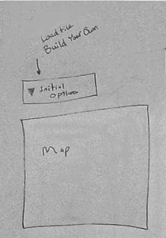
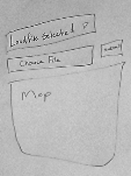
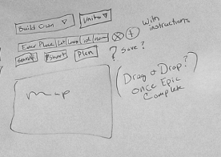

# Sprint 3 - *t03* - *WOPR*

### Build shorter trips!
### Sprint Leader: *Minjie Shen*

## Definition of Done

* Sprint Review and Restrospectives completed (sprint3.md).
* Version in pom.xml should be `<version>3.0.0</version>`.
* Increment deployed for demo and testing as server-3.0.jar.
* Increment release `v3.0` created on GitHub with appropriate version number and name.
* Epics and Tasks updated in Zenhub.

## Policies

#### Test Driven Development
* Write method headers, javadoc, unit tests, and code in that order for all methods/functions.
* Unit tests are fully automated.
* Code coverage is at least 50%, 70% preferred.
#### Clean Code
* Code adheres to Google style guides for Java and JavaScript.
* Code Climate maintainability of A or B.
#### Configuration Management
* Always check for new changes in master to resolve merge conflicts locally before committing them.
* All changes are built and tested before they are committed.
* All commits with more than 1 line of change include a task/issue number.
* All pull requests include tests for the added or modified code.
* Master is never broken.  If broken, it is fixed immediately.
#### Continuous Integration
* Travis successfully builds and tests all pull requests for master branch.
* All Java dependencies in pom.xml.  Do not load external libraries in your repo. 

## Plan

For Sprint 3, WOPR decided to pursue 3 new epics that we feel we can knock out of the park. This is not counting older epics that
the team considers a priority throughout the time spent in this company. These priority epics include: all code must be clean, all 
clients and servers must interoperate, the solution must be responsive for mobile devices, and all code must be tested. The new epics
we've focused on for this sprint are: I want to design a trip from scratch so I can stop using the other tool, I want to make and save
changes to the trip, and I want my trips to be shorter, in order from highest to lowest priority. Creating a search class, and updating
our config and options class on the back-end, while creating an intuitive user interface on the front-end, will allow the client to
create a trip from scratch. We believe this will help solve our first epic. Communicating with the database for saving trips on the
back-end and building a search area on the front-end will help users save and load their trips, taking care of our second epic. We feel
that the third and last epic can be finished by adding the nearest neighbor algorithm to the Calculate class, and constructing a button
for shorter trips. With all of this in mind, the team came to the conclusion that Sprint 3 can be successful if these tasks relating to
the epics listed above are met.

| Page Diagram | Description |
|:------------:|-------------|
|  | Home page of our sprint 3 layout. This is where the initial selections will take place. Some of the selections will be different due to clarifications we received since drawing this diagram. The components will all be the same though. |
|  | File upload selection. The map is the map of colorado. |
|  | Build Your Own Trip form. It has a dropdown for the desired units and optimization, when added. User defined reveals inputs for unitName and unitRadius. The insert button will eventually be replaced with drag and drop. Instructions will be provided for both. User can delete a place or add one into the trip at any location. The search button will return possible locations to add. The submit button plans the trip. The reverse button reverses the trip. A map of Colorado is displayed. Save option is omitted. |
|  | Response page. There will be an itinerary with information fields that can be hidden if the user does not want to see them. It will offer a save option for the trip. It will also display the map with the trip's route as an overlay. |
|  | Design diagram for Search class (User Interface) |
|  | Hierarchy diagram for Search class (Server) |

Epics planned for this sprint.

* *234 TripCo: All code must be tested: minimum 50% coverage, preferred 70% coverage.*
* *236 User: I want to design a trip from scratch so I can stop using the other tool: Create an empty itinerary.*
* *232 User: I want to make and save changes to the trip: Enable the users to add or remove destinations; choose a different starting location; reverse the order of the trip; find possible destinations so that the users can add them; save the changes made to the trip.*
* *233 User: I want my trips to be shorter: Use nearest neighbor to build a shorter trip.*
* *235 User: I want to choose what information is displayed in the itinerary and map: allow additional attribut/evalue pairs to be captured for destinations whether they are entered manually or obtained from a database; allow the user to select attributes to display in the itinerary, including the latitude and longitude.*
* *240 User: I'd like even shorter trips: Use 2-opt to improve the nearest neighbor tours.*

## Metrics

| Statistic | # Planned | # Completed |
| --- | ---: | ---: |
| Epics | *10* | *value* |
| Tasks |  *28*   | *value* | 
| Story Points |  *48*  | *value* | 

*At the beginning of the previous sprint, we planned 12 tasks and 25 story points, however we ended up with 52 tasks and 62 story points. So in this sprint, we broke the large tasks down and created more tasks than the previous sprint and we allocated 48 story points for this sprint.*

*Enter the `# Completed` at the end of the sprint.  Include a discussion about any difference in the number planned versus completed tasks and story points.*

## Scrums

| Date | Tasks closed  | Tasks in progress | Impediments |
| :--- | :--- | :--- | :--- |
| *10/01/2018* | *237, 238, 239* | *111, 122, 270, 272, 291* | *Trying to wrap our heads around the new plan* |
| *10/03/2018* | *270, 272, 291* | *111, 122, 261* | *Worrying about studying for other exams* |
| *10/05/2018* | *261, 300* | *111, 122, 302, 291* | *Worrying about studying for other exams* |
| *10/08/2018* | *302, 291, 301* | *122, 111, 243, 245* | *Personal life issues* |
| *10/10/2018* | *243, 245, 249, 247, 266, 265, 288* | *111, 122* | *Headaches trying to learn ReactJS, ReactStrap* |
| *10/12/2018* | *255, 264, 323, 327, 251, 268, 277* | *111, 122, 250, 258, 259, 263, 326, 343, 345, 347, 349* | *Nearest neighbor algorithm, front end stuff, boost the test coverage* |
| *10/16/2018* | *343, 345, 347, 349,* | *256, 258, 259, 260, 262, 263, 267, 326, 354, 355, 356, 357* | *Working on CS314 wholeheartedly!* |
| *10/17/2018* | *256, 258, 259, 260, 262, 263, 267, 326, 354, 355, 356, 357* | *250, 182, 361, 122* | *Working on CS314 wholeheartedly!* |

## Review

*We were able to get a map with the route displayed up. We successfully set up our front end page. We added tests for both front
and back end. We added the search function and connected to the database. We handled our first major conflict and came out
a stronger team. 

#### Completed Epics in Sprint Backlog 

*Describe the solution based on the completed epics and list the epics below.*

* *236 User: I want to design a trip from scratch so I can stop using the other tool: Create an empty itinerary.*
* *232 User: I want to make and save changes to the trip: We enable the users to add and remove destinations; choose a different starting location; reverse the order of the trip; find possible destinations so that the users can add them; save the changes made to the trip.*
* *233 User: I want my trips to be shorter: We use nearest neighbor to build a shorter trip.*
* *235 User: I want to choose what information is displayed in the itinerary and map: allow additional attribut/evalue pairs to be captured for destinations whether they are entered manually or obtained from a database; allow the user to select attributes to display in the itinerary, including the latitude and longitude.*

#### Incomplete Epics in Sprint Backlog 

*Describe capabilities not included in the release and list the epics below with an explanation.*

* *234 TripCo: All code must be tested: minimum 50% coverage, preferred 70% coverage.*

#### What Went Well

* Planning and breaking up tasks into smaller more manageable jobs.
* Javascript started being easier
* We have started communicating well.

#### Problems Encountered and Resolutions

* There were a lot of technical difficulties in getting the map from sprint 2 up and running. Asked for help. 
* There were technical difficulties with bugs in javascript. Worked together and debugged and learned.

## Retrospective

*This sprint was challenging in a lot of ways. We had a lot of technical difficulties while trying to learn javascript. We also 
had issues with communication at the beginning of the sprint, as well as time mananagement. We have made great strides as a team through 
this sprint. We did hit a category 5 hurricane level of storming, or better yet, I did (Lacey) and the rest of my team responded 
a lot better than I did and they deserve some kudos from me. Overall, I think we made improvements and grew as a team this sprint.

#### What we changed this sprint

*We improved our communication skills*
*We made improvements to time management*
*We improved our planning skills*

#### What we did well

*Again, I (Lacey) want to give kudos to my teammates for the way they responded to my stupidity, they handled it and responded
really well.*
*Stayed on task.*
*Began working well together.*

#### What we need to work on

*Not taking on too much work.*
*Planning*
*Asking for help*
*Getting rest!!!!!*

#### What we will change next sprint 

*We will continue to make improvements to our communication*
*We will continue to work on planning*
*We will continue to work on our time management skills* 