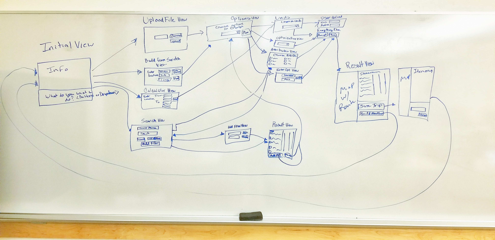
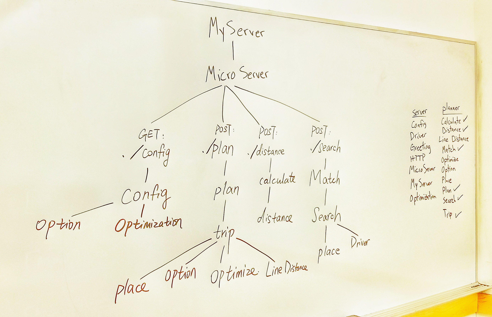
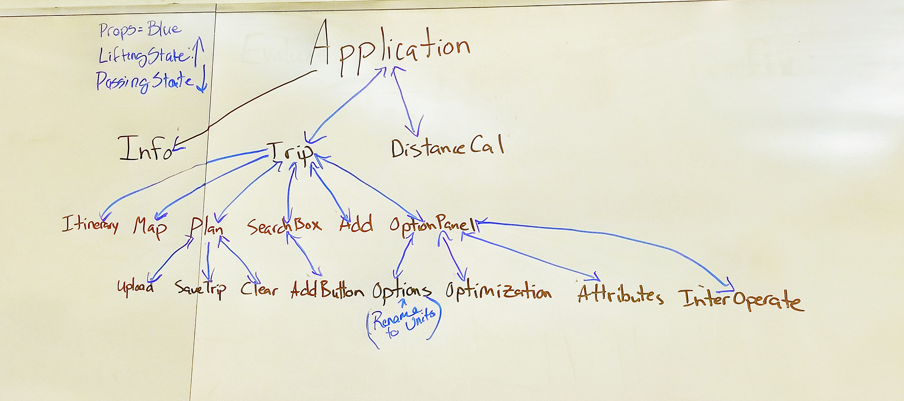

# Sprint 4 - *t03* - *WOPR*

## Goal

### Interactive Maps and Shorter Trips!
### Sprint Leader: Lacey Willmann

## Definition of Done

* Sprint Review and Restrospectives completed (sprint4.md).
* Version in pom.xml should be `<version>4.0.0</version>`.
* Increment deployed for demo and testing as server-4.0.jar on the production server.
* Increment release `v4.0` created on GitHub with appropriate version number and name.
* Epics and Tasks updated in Zenhub.

## Policies

#### Test Driven Development
* Write method headers, javadoc, unit tests, and code in that order for all methods/functions.
* Unit tests are fully automated.
* Code coverage is at least 50%, 70% preferred.
#### Clean Code
* Code adheres to Google style guides for Java and JavaScript.
* Code Climate maintainability of A or B.
#### Configuration Management
* Always check for new changes in master to resolve merge conflicts locally before committing them.
* All changes are built and tested before they are committed.
* All commits with more than 1 line of change include a task/issue number.
* All pull requests include tests for the added or modified code.
* Master is never broken.  If broken, it is fixed immediately.
#### Continuous Integration / Delivery
* Travis successfully builds and tests all pull requests for master branch.
* All Java dependencies in pom.xml.  Do not load external libraries in your repo. 
* All pull requests are deployed on the development server.
* The development server is never broken.  If broken, it is fixed immediately.

## Plan

*WOPR expects to have a very successful release for our 4.0 release. We were pretty happy with our 3.0 product, but
we really feel that this will be a great sprint for us. Not including our 'static' epics that we always focus on, we have
four epics that we think will help us reach our goal of creating a product that users will really benefit from. 
Our shorter trips epic will have our 2-opt algorithm integrated in our system to help the client plan a more optimal trip 
than our nearest neighbor. The epic focused on viewing the trip in other tools will provide a user friendly experience of
displaying a world map for whatever trips the client decides to make, along with many options for adding new places with a
variety of specific choices for each one (id, name, elevation, etc.). For planning trips worldwide, we have tasks that deal
with creating back end systems that communicate with the more robust database, and making trips that can span the globe. 
Itinerary and map display is another epic in our repertoire that will enhance our product. Being able to decide different
attributes to display in the itinerary and/or the map can help clients modify their trip to their liking. With these epics
and handful of many tasks that have been outlined above, WOPR is confident that the release of 4.0 will be their best yet!*

| Page Diagram | Description |
|:------------:|-------------|
|  | The proposed layout and flow chart for our page for sprint 4. We want to try to hide some of the elements until they are needed to reduce clutter. |
|  | Hierarchy diagram for our backend.  |
|  | The state diagram for our client side. Blue lines represent state being passed; the arrows show the direction the state flows.|

Epics planned for this sprint.

* *112 TripCo: All clients and servers must interoperate!*
* *113 TripCo: The solution must be responsive for mobile devices.*
* *114 TripCo: All code shall be clean!*
* *234 TripCo: All code must be tested.*
* *393 User: I'd like even shorter trips.*
* *394 User: I want to plan trips worldwide.*
* *403 User: I want to choose what information is displayed in the itinerary and map.*
* *395 User: I want to view my trip in other tools.*
* *396 User: I want trip planning to be fast.*
* *397 User: I want the shortest trips possible.*

## Metrics

| Statistic | Planned | Completed |
| --- | ---: | ---: |
| Epics | *7* | *6* |
| Tasks |  *21*   | *77* | 
| Story Points |  *35*  | *146* | 

*Although in the previous sprint, we ended up with 76 issues and 130 story points, we plan to have 28 issues and 35 story points for this sprint, because we are familiar with all the stuff and we are confident when we plan.*

*Just like last sprint, many little extra add-ons and addendums were tacked on to make sure we covered everything possible
for this sprint.*

## Scrums

| Date | Tasks closed  | Tasks in progress | Impediments |
| :--- | :--- | :--- | :--- |
| 10/22/2018 | 405 | 436, 434, 416 | Getting motivated after turning in last sprint | 
| 10/24/2018 | 436, 434, 416 | 435, 439, 438, 443 | Dealing with other homework from other classes |
| 10/26/2018 | 435, 439, 438, 443 | 441, 442, 431, 421 | It was Friday |
| 10/29/2018 | 441, 442, 440, 421 | 410, 406, 426, 425 | It was Monday |
| 10/31/2018 | 410, 406, 426, 425, 413, 423 | 414, 412, 383, 422, 460 | Happy Halloween! |
| 11/02/2018 | 414, 412, 383, 422, 460 | 458, 411, 407, 437 | Bugs and compatibility issues |
| 11/05/2018 | 458, 411, 407, 437, 419, 467, 500, 475 | 473, 480, 477, 481, 415, 409 | More compatibility issues |
| 11/07/2018 | 473, 480, 477, 481, 415, 409, 418 | 427, 420, 417, 424, 519, 483, 482, 520 | Exams and homework! |

## Review

*For Sprint 4, team WOPR once again worked better and more fluidly to create a website that they are proud of. We made
a button that can save maps, a filter for our search so users can better narrow down what they're looking for, an add
all button in case the client has time and money, a better and more intuitive itinerary, and a brand new KML interactive
google map with trips displayed on it. There are many other nuanced details that were added as well, and we hope users
will agree with us that this is the best trip planning experience from the WOPR's yet.*

#### Completed Epics in Sprint Backlog 

*Not including our epics that should always be done, clients should expect to make trips even shorter. They should also
be able to include many options of what they can see on the itinerary, making their experience a little more personalized.
What if they want to travel worldwide you ask? They can do that as well! Also, google maps has been implemented, so if 
they would like, users can choose to view a kml map, making moving around the globe much easier. We included epic #234 in
this sprint specifically because we had an actualy goal to achieve for it this time, namely 50% minimum coverage.*

* *#393 User: I'd like even shorter trips*
* *#403 User: I want to choose what information is displayed in the itinerary and map.*
* *#394 User: I want to plan trips worldwide.*
* *#395 User: I want to view my trip in other tools.*
* *#396 User: I want trip planning to be fast.*
* *#234 TripCo: All code must be tested.*

#### Incomplete Epics in Sprint Backlog 

*We were not able to implement trips using the 3-opt algorithm. Therefore, clients can't request trip distances that are
more optimized than 2-opt.*

* *#397 User: I want the fastest trips possible: This was 3-opt, and we didn't have enough time to tackle it... yet!*

#### What Went Well

*Learning and growing since "The Sprint 3 incident", team WOPR's communication was leagues better than at the start of
the semester (or since getting hired). Team meetings are regularly attended by all, and serious time and effort was put
into making sure everthing was working in tip top shape.*

* *Communication on slack*
* *Helping each other out on particularly difficult code*
* *Getting epics done like it's nobody's business*

#### Problems Encountered and Resolutions

*Other classes, homework, and jobs once again reared their ugly heads to try and deter us from getting everything done.
Luckily, we were able to use our time (reasonably) well and made sure our tasks were finished.*

* *Classes*
* *Homework*
* *Exams*

## Retrospective

*Looking back on this sprint, the WOPR members are pleased, if not surprised that goals were met, tests were made, searches
were searched, and compared to the first sprint, the last 3 weeks went by with relatively minor speed bumps. We hope we
can bring this work ethic and tenacity into the final sprint, and finish this project with a bang.*

#### What we changed this sprint

*We kept improving our communication since last sprint. Not just with what we were working on, but most everything, which
was nice. Asking for help was another thing we changed. We sought out help from as many resources as we could, be it Dave,
devops, online, and especially each other.*

#### What we did well

*Trying not to sound pretentious, most everything went well for us for this sprint. Tasks and epics were completed, good
questions were asked, teamwork was improved upon, members were overall pleasant to each other, despite other deadlines and
long nights, and some **serious** cleaning of code was done.*

#### What we need to work on

*For this sprint, 3 team members were on fire with updates, changes, and time spent on the project. 1 (the writer of this)
was not. More commits could be made and this team could be incredible. Unfortunately, it's not quite there yet. Other 
than self deprecation, the team can try to have 99% of tasks done before the day everything is all due. There was definitely
no crazy rush, but things could be better with time management.*

#### What we will change next sprint 

*This team will, when creating a pull request, have whatever source code they want merged with the testing for said code,
so code coverage will not drop. This will help getting the coverage to even greater numbers such as 60% and higher.*
