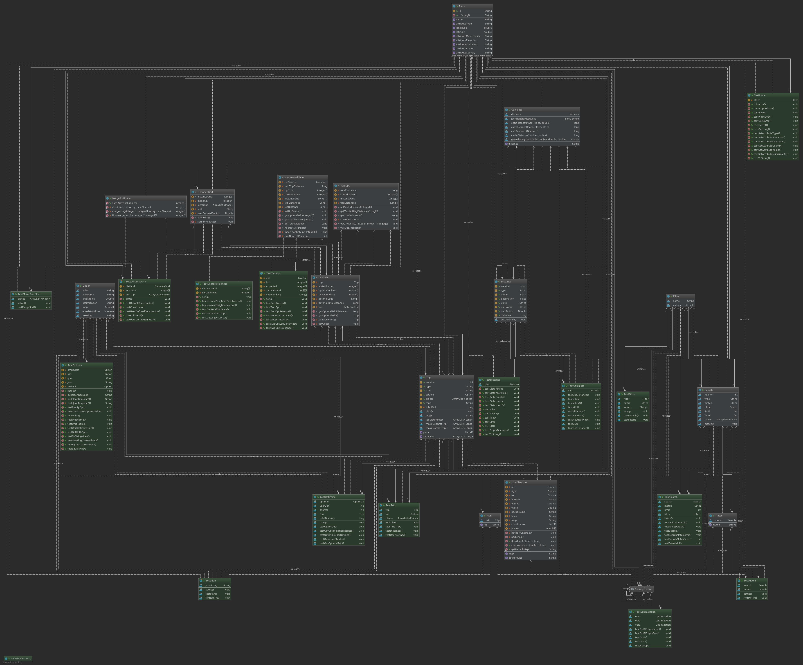
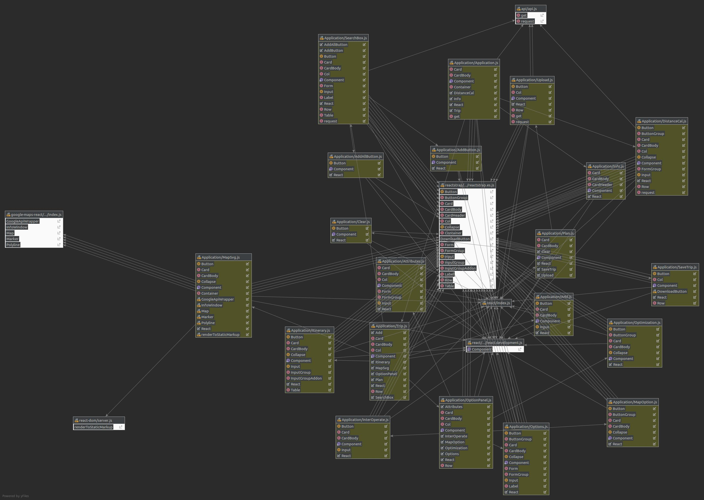
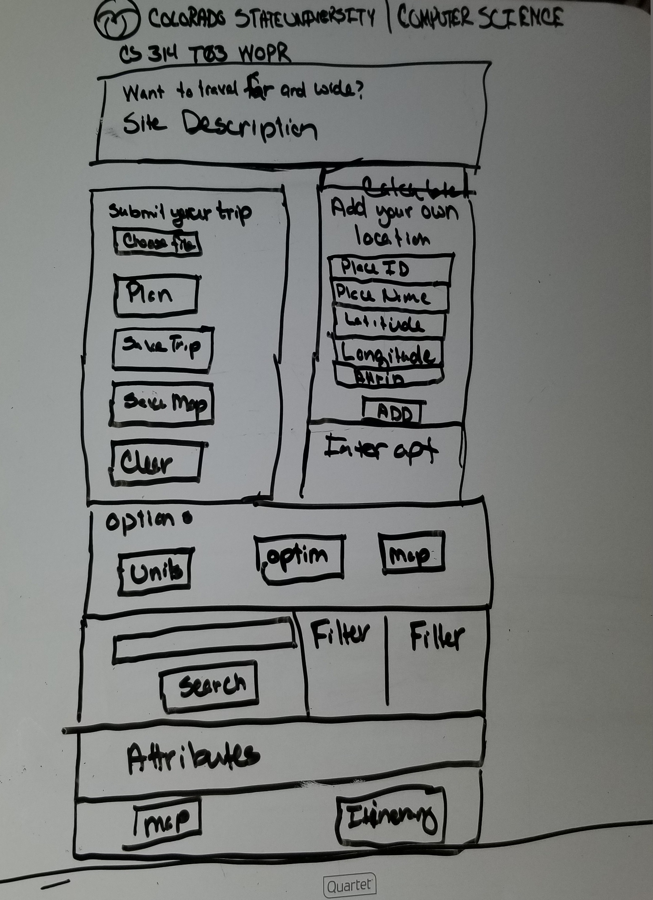

# Sprint 5 - *t03* - *WOPR*

## Goal

### Wrap It Up!
### Sprint Leader: *Josh Keahey*

## Definition of Done

* Sprint Review and Restrospectives completed (sprint5.md).
* Version in pom.xml should be `<version>5.0.0</version>`.
* Increment deployed for demo and testing as server-5.0.jar on the production server.
* Increment release `v5.0` created on GitHub with appropriate version number and name.
* Epics and Tasks updated in Zenhub.

## Policies

#### Test Driven Development
* Write method headers, javadoc, unit tests, and code in that order for all methods/functions.
* Unit tests are fully automated.
* Code coverage is at least 70%.
#### Clean Code
* Code Climate maintainability of A or B.
* Code adheres to Google style guides for Java and JavaScript.
#### Configuration Management
* Always check for new changes in master to resolve merge conflicts locally before committing them.
* All changes are built and tested before they are committed.
* All commits with more than 1 line of change include a task/issue number.
* All pull requests include tests for the added or modified code.
* All tests pass.
* Master is never broken.  If broken, it is fixed immediately.
#### Continuous Integration / Delivery
* Travis successfully builds and tests on all pull requests for master branch.
* All Java dependencies in pom.xml.  Do not load external libraries in your repo. 
* All pull requests are deployed on the development server.
* The development server is never broken.  If broken, it is fixed immediately.

## Plan

*Sprint 5. This is where it's all been heading towards. Each of the four WOPR members is primed and ready to go for the
final leg of their trip website. Forming is taking place, and the team is ready to push towards the final goal and put
out their completed project. There are a total of 9 epics we will complete for this sprint. This includes the prior epics
that were considered long standing goals to always pay attention to. Since this is the last sprint, we want to complete all
of them now, so for epics 112, 113, 114, and 234, we plan to have no problems with other team servers, have an A or B on 
code climate with at least 50% coverage, and have our website work well on small devices like tablets and phones. We will
tweak our user interface so that the user experience is that much better when using our site. If the client wants to travel
the world on their private jet and try a trip of 700+ places, our server will be ready for it without lag. For this epic,
we plan on using concurrency to help with making threads to work on their trip in parallel. With our brand new 3-opt
algorithm, we can also help the user plan trips that are optimized, so not to waste time and money. We already have a KML
map working as is, but our goal is to build on that even more, letting anyone pan around, zoom, save the trip on the map,
and even drop onto street mode to get an idea of what they can expect when visting a specific place on their excursion.
Last but certainly not least, we will humbly let the user know who brought this website to life, and dedicated many,
**many** hours into bringing their vision into fruition. For this, we plan to use either a tab on the site, or a splash page
to let the client know who the people are behind the scenes.*

*Include any design diagrams prepared during sprint planning (user interface, component diagram, component/state/hierarchy, etc.) with a short paragraph for each.

| Page Diagram | Description |
|:------------:|-------------|
|  | This shows the formation of our rear end. It starts in Place and fans out from there. |
|  | This shows the relationships between the javascript files, the arrows show the movement of state between the classes. |
|  | This is what our goal for the end user interface is. |

Epics planned for this sprint.

* *112 TripCo: All clients and servers must interoperate!*
* *113 TripCo: The solution must be responsive for mobile devices.*
* *114 TripCo: All code shall be clean!*
* *234 TripCo: All code must be tested.*
* *536 User: Make the system easier to use.*
* *537 User: I want trip planning to be fast.*
* *538 User: I want the shortest trips possible.*
* *539 User: I want to know who to thank for this application*
* *542 User: I want an interactive map.*

## Metrics

| Statistic | Planned | Completed |
| --- | ---: | ---: |
| Epics | *9* | *8* |
| Tasks |  *43*   | *99* | 
| Story Points |  *49*  | *146* | 

*Although in the previous sprint, we ended up with 104 issues and 151 story points, we plan to have 43 issues and 49 story points for this sprint, because we have already completed most of the important epics and we don't have much to do for this sprint.*

*As always, small tasks were sprinkled throughout the sprint with front and back end classes that needed testing, cleaning
or other little tweaks. We ended up finishing all tasks but one, and it took 99 tasks to do so. There also ended up being
146 story points; 5 less than last time, but more than we thought it would take. What we created definitely shows how much
time and effort went into all those points however, and we couldn't be happier with how it turned out.*

## Scrums

| Date | Tasks closed  | Tasks in progress | Impediments |
| :--- | :--- | :--- | :--- |
| *11/12/2018* | *535, 534, 541* | *N/A* | *None yet!* | 
| *11/14/2018* | *479,560,561,562,563,564,578* | *577, 580, 586* | *None yet!* | 
| *11/16/2018* | *577, 553, 555, 580, 583, 585, 586, 588* | *598* | *None yet!* | 
| *11/19/2018* | *598, 599* | *582, 600, 602, 603, 612* | *None yet!* | 
| *11/21/2018* | *550, 582, 584, 590, 600, 601, 602, 603, 604, 605, 606, 607, 579, 596, 608, 609, 612, 617* | *618, 620* | *None yet!* | 
| *11/23/2018* | *618, 619, 620, 616* | *570, 624, 625* | *None yet!* | 
| *11/26/2018* | *570, 621, 622, 623, 624, 625* | *587, 625, 613* | *None yet!* | 
| *11/28/2018* | *547, 566, 567, 568, 573, 574,591, 630, 631, 632, 633, 636, 638,640, 543, 549, 571, 642, 647, 650* | *613, 643, 544, 546, 548, 648* | *None yet!* | 
| *11/30/2018* | *544, 546, 548, 682, 683, 684, 687* | *643, 653, 692, 693, 694* | *Final projects for other classes* |
| *12/1/2018* | *643, 653, 692, 693, 694* | *696* | *Final projects for other classes* |
| *12/2/2018* | *696* | *688, 689, 690* | *Final projects for other classes* |
| *12/3/2018* | *688, 689, 690* | *699* | *Final projects for other classes* |

## Review

*Team WOPR ended this great semester with a Sprint that they were very pleased with, even with hardships and speedbumps
along the way. We made the website useability more fluid for users, and trip planning is always quick, no matter how
large the trip. Our code was tested and cleaned, *especially* compared to our what we had towards the beginning of the
semester. A new developer page was created so users of the site could know who was responsible for the planning of their
trips. Interoperability and performance on mobile phones was treated with care, as our server can work with others, and
vice-versa, and works on cell phones without sacrificing the user experience. Since google maps was implemented last sprint,
we did not have to worry about much concerning that except for little bug fixes and updates. The most impactful thing that
was tackled this sprint was creating the 3-opt algorithm so that trips can be optimized even further for clients. With these
new features, including more user interface changes, team WOPR and all its members are excited to let people use their
product, and proud to have been part of a team that works well together and gets things done!*

#### Completed Epics in Sprint Backlog 

*Technically speaking, epics 112, 113, 114, 234, and 536 are almost never 'done', but taking this class in consideration,
and what we've made as a team, we are considering them finished. Trips have been constructed in a way so that even if
they are hundreds of places long, trip calculation times are low and quick to load the itinerary. 3-opt was succesfully
implemented, so trips are much more optimized. Our developer pages was created so users can gaze upon the beautiful people
that worked through blood, sweat and tears to bring them the site. Lastly, they can get a better look at where they're going
by using our google maps api. This adds a certain 'professionalism' to our site.*

* *#112 TripCo: All clients and servers must interoperate!*
* *#113 TripCo: The solution must be responsive for mobile devices.*
* *#114 TripCo: All code shall be clean!*
* *#234 TripCo: All code must be tested.*
* *#536 User: Make the system easier to use.*
* *#538 User: I want the shortest trips possible.*
* *#539 User: I want to know who to thank for this application.*
* *#542 User: I want an interactive map.*

#### Incomplete Epics in Sprint Backlog 

*There were very unfortunate circumstances that arose during this sprint for one of the WOPR members, and as much as we
wanted to finish everything, it ultimately couldn't all be done. To help make sure we focused on a smaller amount of epics
this sprint and made sure they were done very well, we decided to put concurrency on the backburner. For everything that
happened this semester, we are still proud of what we did accomplish.*

* *#537 User: I want trip planning to be fast.*

#### What Went Well

*I would definitely put our team under the performing category of the group development stages. We communicated very well,
tasks were done, teammates are respectful and listen well to others, and merging pull requests in a timely manner. *

* *Communication*
* *Listening*
* *Receiving constructive criticism*
* *Sharing information and ideas with other team members*

#### Problems Encountered and Resolutions

*A team member of WOPR had a very unfortunate personal matter come up, and contributing was extremely difficult for them.
The rest of the team understood that sometimes life happens, and were able to finish what we could in their stead. It wasn't
very difficult anyways, since the the hard work of all four members from prior sprints helped put us into a position where
the last sprint was not as bad as it could have been.*

* *Effectively working with 3 members for some of the sprint*

## Retrospective

*Looking back on this sprint, and indeed, on the whole semester, it's humbling to see how far we've come and how much we've
learned (especially with Javascript and React). Through the good times and the bad, we worked hard and were able to work
well as a team. I think we're all glad to have been put together for this semester.*

#### What we changed this sprint

*We took the cleaning of code even more seriously this sprint, so that every file but one in our project was considered an
'A' on code climate. We focused more on testing of code as well, and got up to 60%. We learned how to work with a member
down for a the last couple weeks, and found a way to still knock the sprint out of the park (in our humble opinions).*

#### What we did well

*There's not much more I can add to from past semesters. Everyone contributed as much as they could. We were all gung-ho
about learning as much as possible, either by ourselves or from other team members. When new code was submitted, it was
cleaner which took less time to go in later and make sure it was spotless, freeing up time for other tasks. Lastly, we
showed up for meetings, and were all around great at being around the lab in case questions were raised.*

#### What we need to work on

*Time management was worked on since last sprint, and everything else that we wantedto work on from prior sprints was
addressed and fixed. We can only imagine what we could create if other classes weren't thrown in the mix. One
thing that could be worked on is even more intimant knowledge of git commands on terminal. Being able to quickly pull, push, 
fetch, merge, and resolve conflicts from command line might have its advantages. Another thing we could work on if there
was a next time for this group is getting a good idea of how things will be set up, like the charts we had for both front
and back end. This could be cleaner, so less time is spent trying to fix it later on.*

#### What we will change next sprint 

*If there was a next sprint, the first would be 100% all the time commit code with test code with it! Also, we would try
to keep in mind the cognitive complexity and lines in a function, and realize that reading this later on might be difficult.
The last thing would be to make sure JavaDoc's are added to all functions, and intermittent comments are also put in to help
clear things up.*
